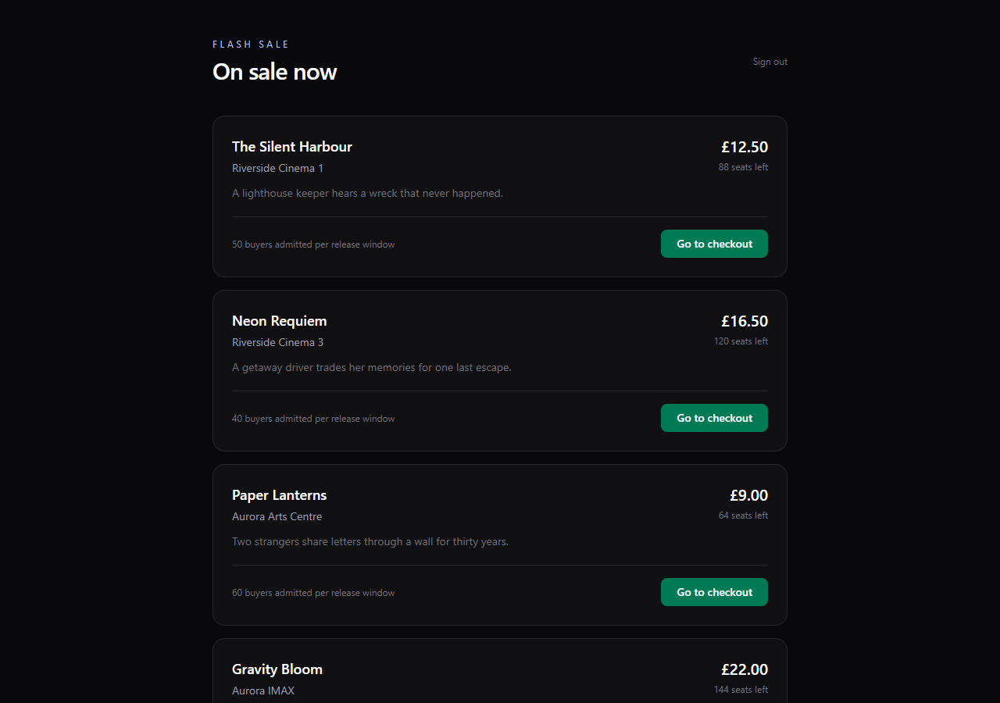
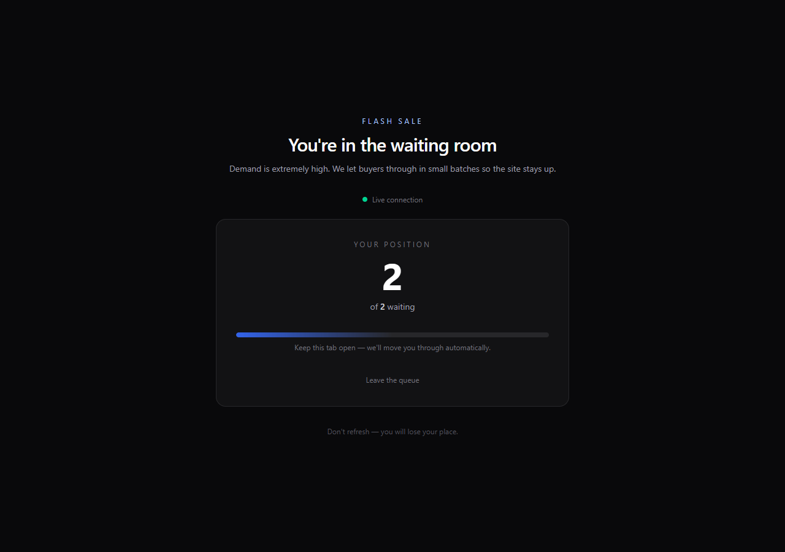
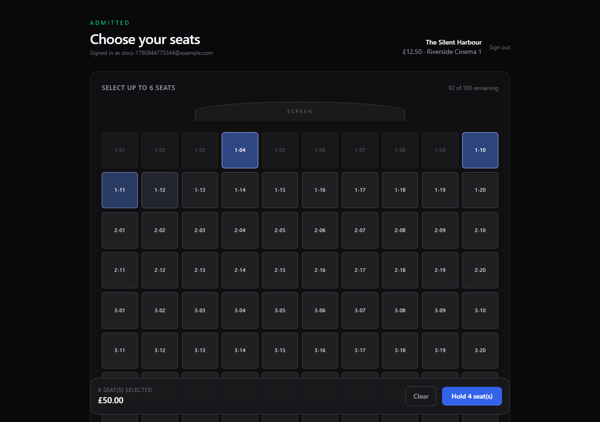
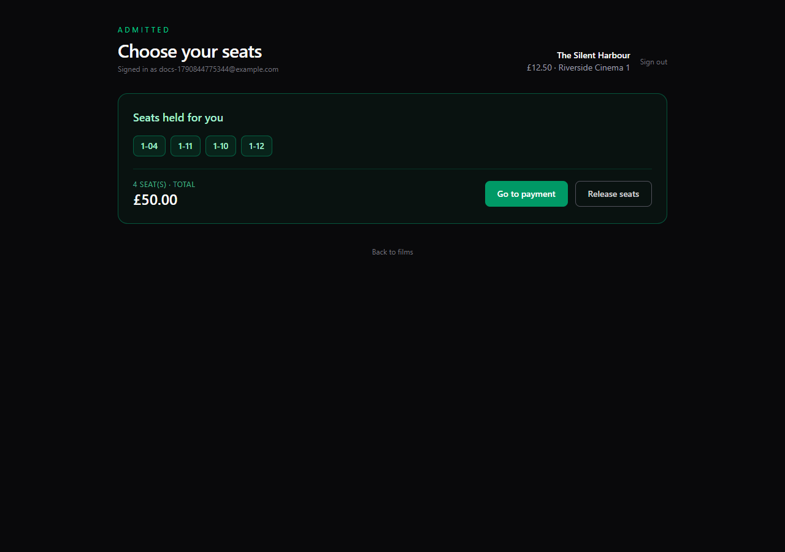
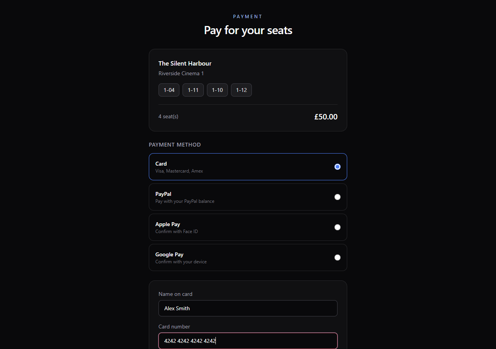
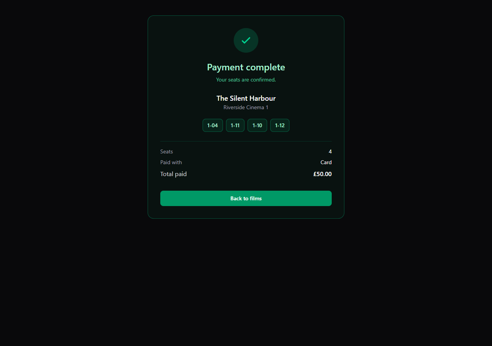

# Flash Sale Ticketing Engine

A high-throughput cinema ticketing system with a **virtual waiting room**, a
**multi-seat basket** and a **payment** step - engineered for the scenario that breaks
naive booking systems: thousands of buyers all trying to grab the same few seats at the
same millisecond.

| | |
|---|---|
| **Backend** | ASP.NET Core 10, EF Core 10, SQL Server, SignalR, JWT |
| **Frontend** | Angular 22 (standalone components, signals), Tailwind CSS v4, RxJS |
| **Tests** | 8 xUnit tests, a real-WebSocket probe, and a full Puppeteer journey |

---

## Screenshots

| Catalogue | Waiting room |
|---|---|
|  |  |

| Multi-seat selection | Held basket |
|---|---|
|  |  |

| Payment | Receipt |
|---|---|
|  |  |

---

## The problem

Open a sale at 10:00 and 50,000 people hit `POST /api/bookings/reserve` within the same
second, all fighting over 200 seats. A naive implementation fails three ways:

1. **Double-booking** - two requests read "Available", both write "Reserved".
2. **The site falls over** - 50,000 concurrent writes exhaust connection pools.
3. **Queue-jumping** - a lucky few grab every seat while everyone else watches.

---

## How it works

### 1. Nobody double-books: `rowversion` + optimistic concurrency

Every `Ticket` row carries a SQL Server `rowversion` column, mapped with EF's
`IsRowVersion()`:

```csharp
builder.Property(t => t.RowVersion).IsRowVersion();
```

The database increments that value on every update. When EF saves, it puts the value it
*read* into the `WHERE` clause:

```sql
UPDATE Tickets SET Status = 'Reserved', AssignedUserId = @user
WHERE Id = @id AND RowVersion = @versionReadEarlier;   -- 0 rows affected
```

If somebody else already moved the row, zero rows change and EF throws
`DbUpdateConcurrencyException`. `BookingController` catches it and returns a clean
**409 Conflict** rather than a 500 or a silent double booking.

> There is also an in-process `KeyedAsyncLock` that serialises attempts on the *same*
> seat. That is a performance optimisation to avoid wasted round-trips - **not** the
> correctness guarantee. `rowversion` is the guarantee, and it holds across multiple API
> instances, which an in-memory lock never could.

### 2. The site stays up: a virtual waiting room

```
buyer connects -> QueueHub.JoinQueue -> IQueueStore (in-memory FIFO)
                                   |
        QueueBackgroundWorker (every 10s) takes the front of the queue
                                   |
                     admit a bounded batch -> SaveChanges
                                   |
              SignalR "QueueStatusChanged" + checkout pass, to those clients only
```

`QueueBackgroundWorker` is a `BackgroundService` that wakes every 10 seconds, admits a
bounded batch from the front of each queue, and pushes a `QueueStatusChanged` event
**to those specific clients only**, using SignalR groups (`user:{id}`). Buyers still
waiting get a refreshed position, so the UI animates forward.

A 50,000-person crowd becomes a trickle of small transactions.

**Ordering matters here, and it was a real bug.** The worker originally pushed the
SignalR event *before* `SaveChangesAsync`. The client reacts to that push by calling
`/api/auth/refresh`, which reads `IsCheckoutAllowed` from the database - so it could read
the pre-admission value (`false`), and the route guard would bounce the buyer straight
back to the waiting room. The fix is to **persist first, then notify**:

```csharp
admittedPushes.Add((userId, payload));            // queue the message
await dbContext.SaveChangesAsync(ct);             // commit the admission
foreach (var push in admittedPushes) SendAsync(...);  // only now notify
```

### 3. Buyers cannot skip the queue: a JWT claim

`CheckoutAllowed` is the single source of truth:

```json
{ "sub": "...", "CheckoutAllowed": "false", "event_id": "..." }
```

- The Angular guard decodes it and redirects to `/waiting-room` when it is `"false"`.
- **The API re-checks the same claim.** The client-side guard is UX; the server-side
  check is the actual security boundary and cannot be bypassed.

Admitted buyers receive a **short-lived checkout pass** (seconds, not hours), so a leaked
token is worthless moments later.

### 4. Multi-seat baskets that survive a race

A buyer can hold up to 6 seats in one order. `POST /api/orders/hold` takes the whole
basket in a **single transaction**:

- **Partial success is normal.** If a rival beats you to 2 of 4 seats, you keep the
  other 2 and are told which were lost, rather than losing the entire basket.
- The transaction runs inside EF's `CreateExecutionStrategy()`, required because the
  context uses a retrying strategy that otherwise forbids user-initiated transactions.
- On a `rowversion` conflict it retries seat-by-seat, keeping whatever is still winnable.

### 5. Order and seat lifecycle

```
Available --(hold)--> Reserved --(payment)--> Sold
    ^                    |
    +--(released / hold expired)------------+
```

`OrderSweeperWorker` expires abandoned baskets and returns their seats to the pool every
30 seconds. Without it, a buyer who walks away would hold seats forever and quietly sell
out the show.

### 6. Authentication

First sign-in for an email registers the account; later sign-ins must match. Passwords are
stored as **PBKDF2-HMAC-SHA256** (100k iterations, random salt) and compared with
`CryptographicOperations.FixedTimeEquals`, so verification cannot be timed to leak the
hash. The JWT signing key lives in **user secrets**, never in the repository - the app
refuses to start without it, which is deliberate.
---

## Project structure

```
flash-sale-engine/
├── backend/
│   ├── src/
│   │   ├── FlashSale.Domain/            Entities + enums. Zero dependencies.
│   │   │   ├── Entities/                User, Event, Ticket, Order, OrderSeat, QueueEntry
│   │   │   └── Enums/                   TicketStatus, OrderStatus, QueueStatus, PaymentMethod
│   │   ├── FlashSale.Infrastructure/    EF Core, JWT, queueing, locking
│   │   │   ├── Persistence/             DbContext + Fluent configs + Migrations
│   │   │   ├── Identity/                JwtProvider, PasswordHasher
│   │   │   ├── Queueing/                IQueueStore / InMemoryQueueStore
│   │   │   └── Concurrency/             KeyedAsyncLock
│   │   └── FlashSale.Api/
│   │       ├── Hubs/QueueHub.cs                        SignalR hub
│   │       ├── Workers/QueueBackgroundWorker.cs        admits buyers every 10s
│   │       ├── Workers/ReservationSweeperWorker.cs     reclaims stale holds
│   │       ├── Workers/OrderSweeperWorker.cs           expires abandoned baskets
│   │       └── Controllers/             Auth, Events, Bookings, Orders
│   ├── tests/FlashSale.Tests/           xUnit: concurrency + queue store
│   └── tools/HubProbe/                  Exercises the hub over a real WebSocket
└── frontend/
    ├── src/app/
    │   ├── core/
    │   │   ├── interceptors/jwt.interceptor.ts     functional HTTP interceptor
    │   │   ├── guards/queue.guard.ts               functional route guard
    │   │   └── services/queue-signalr.service.ts   RxJS wrapper over the hub
    │   └── features/
    │       ├── events/                  catalogue + sign-in
    │       ├── waiting-room/            live queue position
    │       └── checkout/                seat map, basket, payment
    └── capture-docs.js                  regenerates the screenshots above
```

Dependencies point inward: `Api -> Infrastructure -> Domain`.

---

## Running it

**Prerequisites:** [.NET 10 SDK](https://dotnet.microsoft.com/download) ·
[Node 20+](https://nodejs.org) |
SQL Server (LocalDB or Express - both work out of the box).

### Terminal 1 - backend

```bash
cd backend
dotnet run --project src/FlashSale.Api
```

Wait for `Now listening on: http://localhost:5099`.

First run automatically creates the database, applies migrations, and seeds
**10 movies / 1072 seats**. Nothing else to set up.

> **One-time step:** set the JWT signing key. The app refuses to start without it -
> that is intentional, because a committed key would let anyone forge tokens.
>
> ```bash
> cd backend/src/FlashSale.Api
> dotnet user-secrets set "Jwt:SigningKey" "<any-random-string-40-plus-chars>"
> ```

### Terminal 2 - frontend

```bash
cd frontend
npm install     # first time only
npm start
```

Open **<http://localhost:4300>**.

---

## Trying it out

1. Sign in with any email and a password of 8+ characters. The first sign-in for an
   email creates the account.
2. Pick a film and **join the waiting room**. You will see a live position and a green
   *Live connection* dot.
3. Within ~10 seconds the background worker admits the front of the queue: the screen
   flips to **"It's your turn"** and moves you to seat selection automatically.
4. **Tick up to 6 seats.** Nothing is locked while you choose. The sticky bar totals it.
5. **Hold N seat(s)** - the whole basket becomes one order. If a rival beat you to some
   seats you keep the rest and are told which were lost.
6. **Go to payment**, choose a method, and pay. You get a receipt.

To watch the race, open a **second browser profile** (or a private window) and sign in as
a different buyer. Two normal tabs share one session, because the token is stored in
`localStorage`.
---

## API

All endpoints except `login` and the catalogue require `Authorization: Bearer <jwt>`.

| Method | Route | Purpose |
|---|---|---|
| `POST` | `/api/auth/login` | Sign in / register. Returns a JWT with `CheckoutAllowed`. |
| `POST` | `/api/auth/refresh` | Re-issue a token reflecting current admission state. |
| `GET` | `/api/events` | Film catalogue with live seat counts. |
| `GET` | `/api/events/{id}` | One film plus its seat map. |
| `POST` | `/api/events/{id}/queue` | Join the waiting room over REST. |
| `POST` | `/api/bookings/reserve` | Claim a single seat (409 on race loss). |
| `POST` | `/api/orders/hold` | Hold several seats at once, creating one order. |
| `GET` | `/api/orders/current?eventId=` | The buyer's live basket. |
| `POST` | `/api/orders/{id}/pay` | Settle an order. Idempotent. |
| `POST` | `/api/orders/{id}/cancel` | Release a basket back to the pool. |
| `GET` | `/api/bookings/mine?eventId=` | The buyer's seat for one film. |

Swagger UI: <http://localhost:5099/swagger>

### Error shape

Every failure returns a stable machine-readable code, so the UI branches on data rather
than on prose:

```json
{ "code": "hold_expired", "message": "The hold on these seats has expired.", "traceId": "..." }
```

`ticket_taken` | `hold_expired` | `seats_unavailable` | `already_paid` |
`checkout_not_allowed` | `invalid_credentials`

---

## Testing

```bash
cd backend
dotnet test                                # 8 xUnit tests

# SignalR contract over a real WebSocket (API must be running)
dotnet run --project tools/HubProbe -- http://localhost:5099

# Full browser journey (both servers must be running)
cd frontend
npm run e2e                                # 10 assertions, asserts zero console errors
```

| Layer | What it proves |
|---|---|
| **xUnit** | A stale `rowversion` really throws `DbUpdateConcurrencyException`; the token rotates on every update; 200 parallel enqueues yield exactly positions 1..200; re-joining does not let a buyer skip the queue; batch admission is FIFO |
| **HubProbe** | Real WebSocket round-trip: authenticate, join, get admitted, receive a checkout pass |
| **Puppeteer** | Sign in, queue, admission, multi-seat hold, payment, receipt |

The concurrency test deliberately bypasses the in-process lock and uses two independent
`DbContext`s - the same situation as two API instances - to prove the **database** is the
arbiter, not application-level locking.

> The E2E and screenshot scripts need Chrome. If Puppeteer's bundled browser is missing,
> run `npx puppeteer browsers install chrome`, or point it at a system Chrome:
> ```bash
> set "CHROME_PATH=C:\Program Files\Google\Chrome\Application\chrome.exe"
> ```

---

## Design decisions

**A lock is not a correctness mechanism.** `KeyedAsyncLock` serialises attempts on one
seat *within a process*, collapsing wasted round-trips. Correctness comes from
`rowversion`, which also covers other API instances and any writer the lock cannot see.
Relying on an in-memory lock alone would be a silent bug the moment the service is scaled
horizontally.

**Persist before you notify.** Pushing an event before its database write commits is a
race, not a style choice - see the waiting-room section above. The same principle applies
to any push that triggers a client-side read.

**Failures are isolated.** The queue worker processes each film independently, so one bad
sale cannot stall every other queue. If a checkout pass cannot be minted, the buyer is
re-queued rather than silently dropped.

**Holds do not leak inventory.** Two sweeper workers reclaim stale work: abandoned single
holds and expired baskets. Without them the show quietly sells out to ghosts.

**Idempotent re-join.** Reconnecting keeps your original queue position instead of
letting you skip the line by cycling your connection.

**One basket per buyer, per sale.** Re-holding releases the previous basket first.
Without that, a seat you already held would get a second `OrderSeat` row and trip the
unique index on `TicketId` - a real bug caught by the browser test.

**Signals, not plain fields, in `OnPush` components.** A `computed()` reading a plain
property never invalidates, so form state lives in signals. Also a real bug: the payment
button stayed permanently disabled because `cardNumber` was not reactive.

**Boring errors.** Every failure carries a stable `code` next to a human message, so the
UI never has to string-match prose.

---

## Known limitations

These are deliberate boundaries of the current scope, not oversights:

- **Single API instance.** `InMemoryQueueStore` is process-local. Multiple instances need
  a Redis-backed `IQueueStore` behind a distributed lock, plus a SignalR backplane. The
  `IQueueStore` interface is already the seam for that swap.
- **Authentication is demo-grade.** Real PBKDF2 hashing and constant-time verification,
  but no email confirmation, password reset, rate limiting, or lockout. Do not put it in
  front of real money without those.
- **Payment is simulated.** `POST /api/orders/{id}/pay` marks the order paid directly.
  There is no payment provider, webhook, or idempotency key against the provider.
- **The session lives in `localStorage`**, so two tabs in one browser share a session.
  Normal for a SPA, but two concurrent buyers need two browser profiles.
- **Not load-tested.** Correctness under contention is proven by tests; throughput has
  not been benchmarked.

---

## License

MIT - see [LICENSE](LICENSE).

